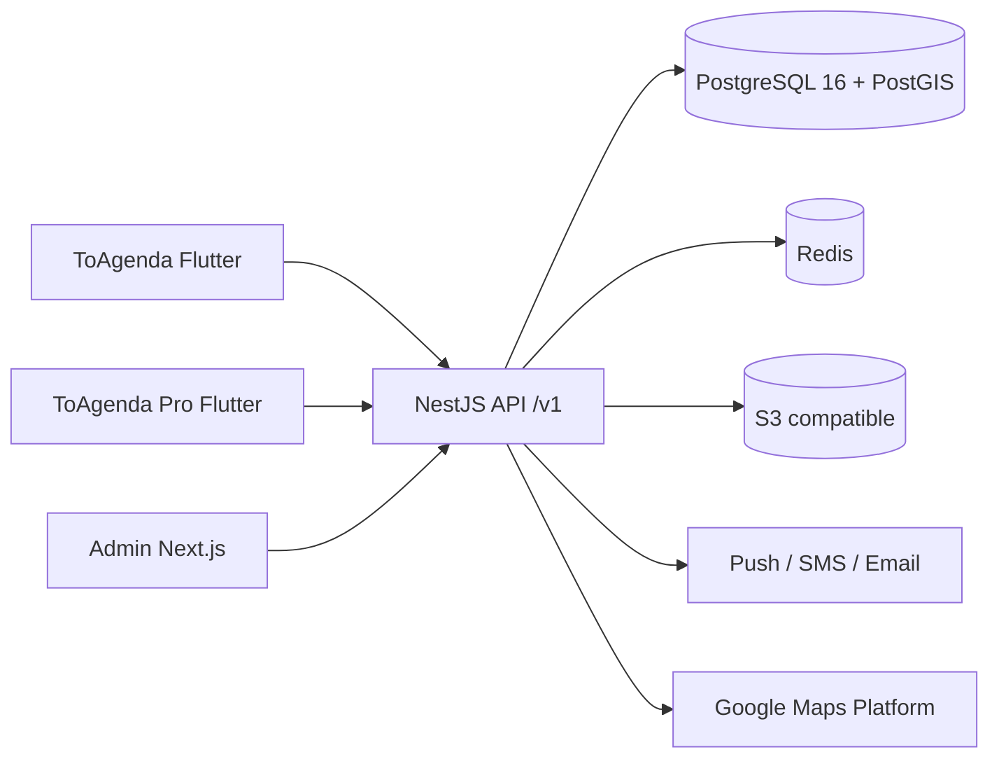

# ToAgenda Ecuador — Technical Requirements Document (TRD)

**Versión:** 1.0  
**Estado:** Base técnica aprobable

## 1. Arquitectura objetivo

ToAgenda se implementará como un monorepo con dos aplicaciones Flutter, un panel administrativo web y una API central. El backend será un monolito modular para reducir complejidad operativa sin perder límites de dominio.



### Estructura prevista

```text
apps/
  consumer_app/       Flutter
  business_app/       Flutter
  admin_web/          Next.js + TypeScript
services/
  api/                NestJS + TypeScript
packages/
  api-contract/       OpenAPI y artefactos generados
  config/             configuración compartida TypeScript
infra/
  docker/             entorno local
docs/                 fuente funcional y técnica
```

## 2. Tecnologías

| Área | Elección |
|---|---|
| Apps móviles | Flutter estable y Dart |
| Estado Flutter | Riverpod |
| Navegación | GoRouter |
| HTTP | Dio + cliente generado desde OpenAPI |
| Almacenamiento seguro móvil | Keychain/Keystore mediante plugin mantenido |
| Panel administrativo | Next.js, TypeScript y React Query |
| API | NestJS, TypeScript y REST `/v1` |
| Persistencia | PostgreSQL 16 + PostGIS |
| ORM/migraciones | Prisma para entidades y SQL versionado para extensiones/restricciones PostGIS |
| Tiempo real | WebSocket autenticado con Socket.IO |
| Caché y colas | Redis + BullMQ |
| Archivos | API compatible con S3 mediante URLs firmadas |
| Mapas | Google Maps SDK, Places y Geocoding |
| Push | Firebase Cloud Messaging; APNs a través de FCM |
| Contrato | OpenAPI generado por NestJS |
| Observabilidad | logs JSON, trazas, métricas y reporte de errores |

## 3. Módulos de backend

- **Identity:** usuarios, OTP, correo, sesiones, tokens y consentimientos.
- **Organizations:** organizaciones, sucursales, miembros, roles y permisos.
- **Catalog:** categorías, servicios, precios, campos y recursos.
- **Scheduling:** horarios, excepciones, bloqueos y cálculo de disponibilidad.
- **Bookings:** retenciones, reservas, transiciones, cancelaciones y reprogramaciones.
- **Discovery:** búsqueda textual/geográfica, filtros y fichas publicadas.
- **Customers:** relación entre consumidor y organización, historial y notas operacionales.
- **Payments:** métodos declarados y comprobantes; sin captura de tarjetas.
- **Reviews:** elegibilidad, reseñas y moderación.
- **Moderation:** solicitudes, documentos, decisiones y suspensiones.
- **Notifications:** plantillas, preferencias, cola, entrega e idempotencia.
- **Subscriptions:** planes, límites y asignaciones; cobro desactivado durante piloto.
- **Audit:** acciones sensibles y contexto de seguridad.

Los módulos se comunican mediante servicios internos y eventos de dominio. No se desplegarán como microservicios durante el MVP.

## 4. Autenticación y autorización

### Consumidores

- Inicio primario con teléfono E.164 y OTP de un solo uso.
- Correo opcional, verificable y utilizable para recuperación/notificaciones.
- El OTP se almacena como hash, expira y tiene límites por número, IP y dispositivo.

### Negocios y administradores

- Teléfono OTP o correo con contraseña robusta y correo verificado.
- Segundo factor obligatorio para administradores de ToAgenda antes del piloto público.

### Sesiones

- Access token firmado de 15 minutos.
- Refresh token rotatorio de 30 días, almacenado como hash y revocable por dispositivo.
- Detección de reutilización invalida la familia de tokens.
- Cierre de una sesión o de todas las sesiones.

### Autorización

- RBAC para roles y verificación de pertenencia a `organization_id` en cada operación Pro.
- Guards separados para consumidor, miembro de organización y administrador.
- Los administradores no obtienen acceso implícito a documentos sensibles: requieren permiso específico y toda consulta queda auditada.

## 5. API y contratos

### Convenciones

- Prefijo `/v1`, JSON UTF-8 y fechas ISO 8601 UTC.
- IDs UUID.
- Paginación por cursor para búsqueda, citas, clientes y auditoría.
- Errores con `code`, `message`, `details`, `traceId` y estado HTTP.
- `Idempotency-Key` obligatorio al crear, confirmar, cancelar o reprogramar reservas.
- `X-Organization-Id` solo selecciona contexto; la autorización se deriva del token y membresía.

### Superficies principales

```text
POST   /v1/auth/otp/request
POST   /v1/auth/otp/verify
POST   /v1/auth/refresh
DELETE /v1/auth/sessions/:id

GET    /v1/discovery/search
GET    /v1/discovery/map
GET    /v1/businesses/:id
GET    /v1/services/:id/availability

POST   /v1/booking-holds
POST   /v1/bookings
POST   /v1/bookings/:id/confirm
POST   /v1/bookings/:id/reject
POST   /v1/bookings/:id/cancel
POST   /v1/bookings/:id/reschedule
POST   /v1/bookings/:id/check-in
POST   /v1/bookings/:id/start
POST   /v1/bookings/:id/complete
POST   /v1/bookings/:id/no-show

GET    /v1/pro/calendar
CRUD   /v1/pro/organizations/*
CRUD   /v1/pro/services/*
CRUD   /v1/pro/team/*

GET    /v1/admin/moderation/*
POST   /v1/admin/moderation/:id/approve
POST   /v1/admin/moderation/:id/request-changes
POST   /v1/admin/moderation/:id/reject
CRUD   /v1/admin/categories/*
```

El archivo OpenAPI será validado en CI y generará el cliente Dart. Cambios incompatibles exigen una nueva versión de API.

## 6. Tiempo real y eventos

WebSocket publicará cambios únicamente a canales autorizados de usuario u organización. Después de reconectar, el cliente refresca el recurso mediante REST; WebSocket no es fuente de verdad.

Eventos mínimos:

- `booking.created`
- `booking.confirmed`
- `booking.rejected`
- `booking.rescheduled`
- `booking.cancelled`
- `booking.reminder_due`
- `business.submitted`
- `business.approved`
- `business.suspended`

Cada evento incluye `eventId`, `type`, `occurredAt`, `actorId`, `organizationId` cuando aplique, `aggregateId`, `version` y payload mínimo. Consumidores asíncronos registran `eventId` para garantizar idempotencia.

## 7. Disponibilidad y consistencia

La disponibilidad se calcula con:

```text
horario de ubicación
∩ horario del profesional
∩ elegibilidad para el servicio
∩ recurso disponible
- excepciones, descansos y bloqueos
- reservas pending o confirmed
- buffers anterior y posterior
```

- La consulta devuelve slots y un `availabilityVersion` de corta vigencia.
- Crear una retención vuelve a validar el slot en una transacción.
- La retención expira a los cinco minutos mediante Redis y persistencia defensiva en PostgreSQL.
- Crear la reserva vuelve a validar y utiliza una restricción de exclusión sobre rangos de tiempo por profesional y recurso.
- La base de datos, no Redis, es la barrera final contra solapamientos.
- Solicitudes manuales ocupan el horario mientras estén `pending`.
- Procesos de expiración son repetibles e idempotentes.

## 8. Geolocalización y búsqueda

- Las ubicaciones usan `geography(Point, 4326)` con índice GiST.
- La búsqueda acepta coordenadas y radio; sin coordenadas acepta provincia/cantón/sector.
- La dirección exacta de domicilios privados puede almacenarse cifrada y no se devuelve en descubrimiento.
- Resultados del mapa se agrupan por viewport y respetan un límite configurable.
- El ranking combina coincidencia textual, categoría, distancia, siguiente disponibilidad, valoración y completitud del perfil; no habrá posicionamiento pagado en MVP.

## 9. Archivos y seguridad

- Carga mediante URL firmada, validación posterior de tipo, tamaño y resultado antimalware.
- Buckets separados para contenido público interno de app y documentos privados.
- Banners/portafolios se sirven por CDN; comprobantes y verificaciones requieren URL firmada corta.
- No se almacenan datos de tarjeta.
- TLS en tránsito, cifrado administrado en reposo, secretos en gestor y rotación.
- Rate limiting, CORS estricto para panel, validación DTO, consultas parametrizadas y cabeceras seguras.
- Backups diarios, recuperación a un punto en el tiempo y simulacro antes del piloto.
- Retención y eliminación se definirán por clase de dato en la política legal; reservas y auditoría no se borran físicamente mediante acciones normales.

## 10. Ambientes y entrega

- **Local:** Docker Compose para PostgreSQL/PostGIS, Redis y almacenamiento compatible con S3.
- **Staging:** datos ficticios, integraciones sandbox y builds internos.
- **Producción:** base y Redis administrados, almacenamiento S3, API contenedorizada con al menos dos réplicas cuando el tráfico lo requiera.
- Migraciones se prueban en staging, incluyen estrategia de reversión y se ejecutan antes del despliegue compatible de API.
- Feature flags controlan planes, categorías sanitarias, reseñas y zonas de lanzamiento.

## 11. Requisitos no funcionales

| Atributo | Objetivo MVP |
|---|---|
| Disponibilidad API | 99,5% mensual durante piloto |
| Latencia lectura API | p95 < 500 ms, excluyendo terceros |
| Búsqueda geográfica | p95 < 1 s con carga esperada de piloto |
| Creación de reserva | p95 < 1,5 s |
| RPO | <= 24 h; objetivo posterior <= 5 min |
| RTO | <= 4 h durante piloto |
| Accesibilidad | WCAG 2.1 AA en recorridos principales |
| Compatibilidad móvil | Últimas 2 versiones mayores de iOS; Android con soporte de seguridad vigente definido al iniciar desarrollo |

## 12. Pruebas técnicas obligatorias

- Unitarias de dominio y transiciones.
- Integración real con PostgreSQL/PostGIS y Redis.
- Contrato OpenAPI y generación de Dart sin diferencias no versionadas.
- Concurrencia con múltiples intentos sobre el mismo slot.
- Aislamiento multiempresa y matriz de permisos.
- Widgets, navegación y accesibilidad Flutter.
- End-to-end de consumidor, negocio y moderación.
- Carga de búsqueda geográfica y calendario.
- Restauración de backup, expiración de holds y reintentos de notificación.
- Análisis estático, dependencias, secretos y vulnerabilidades en CI.

