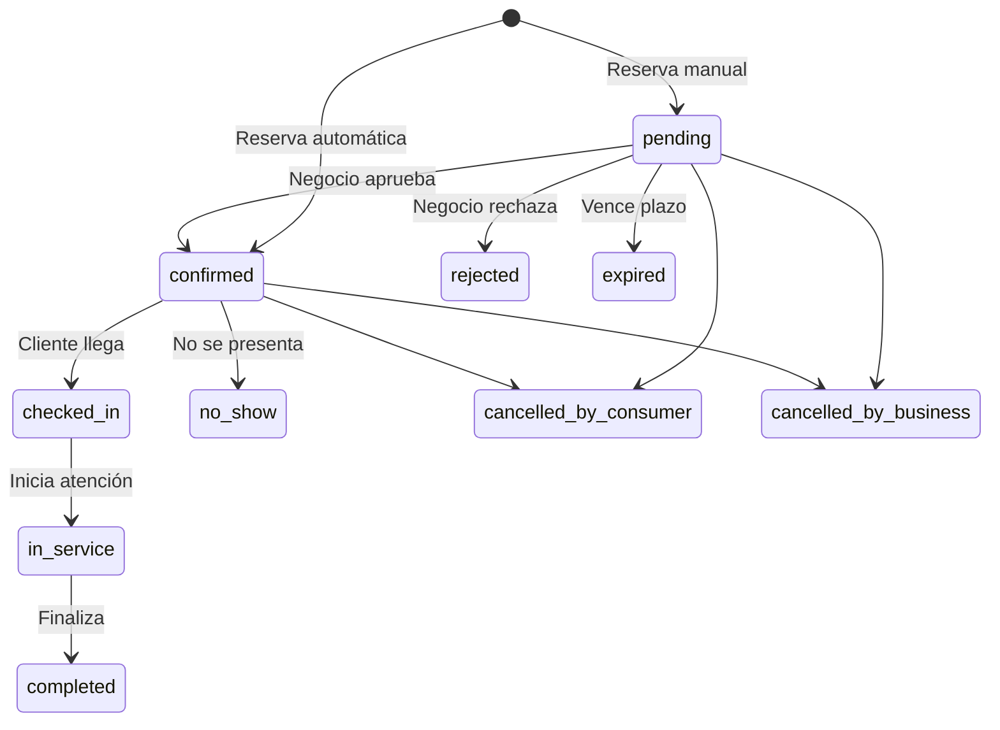
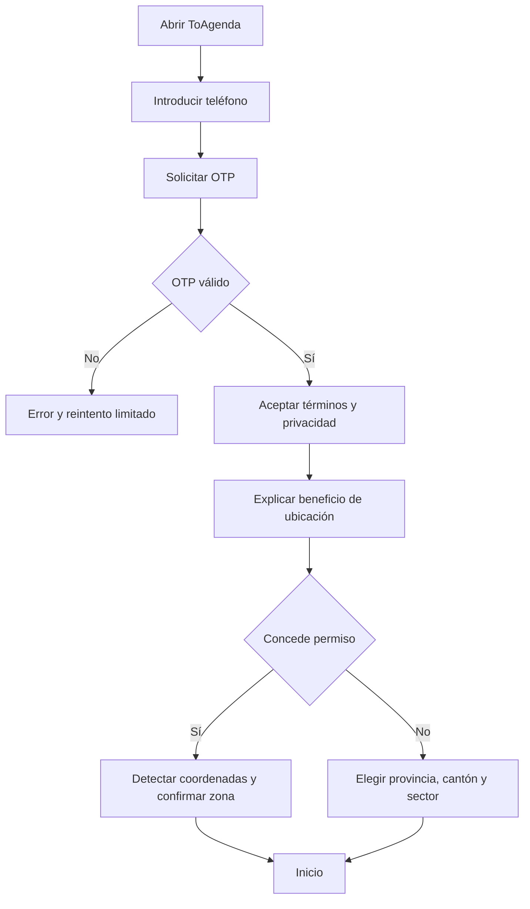
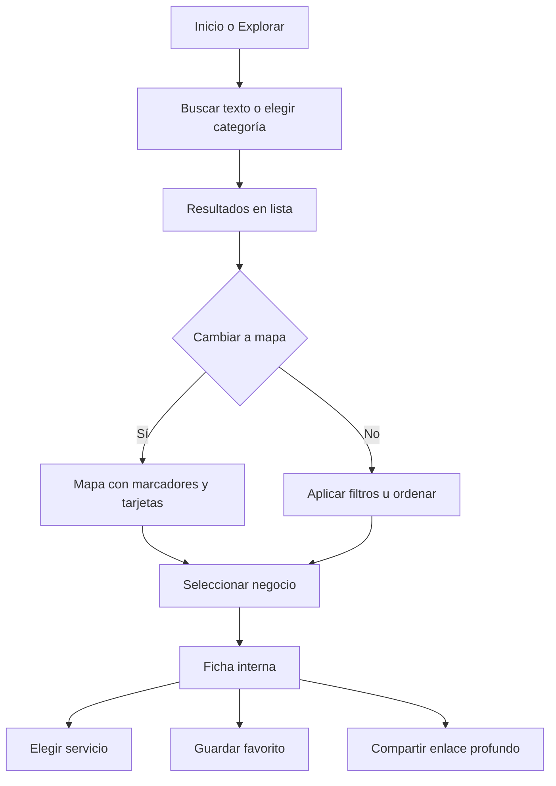
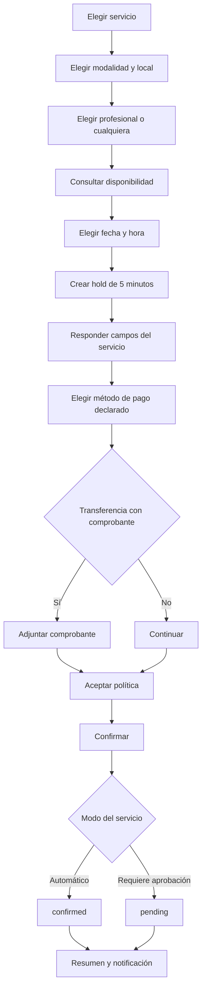
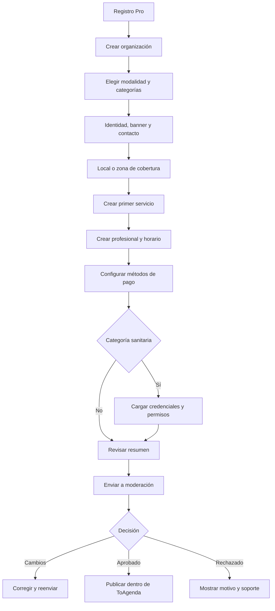
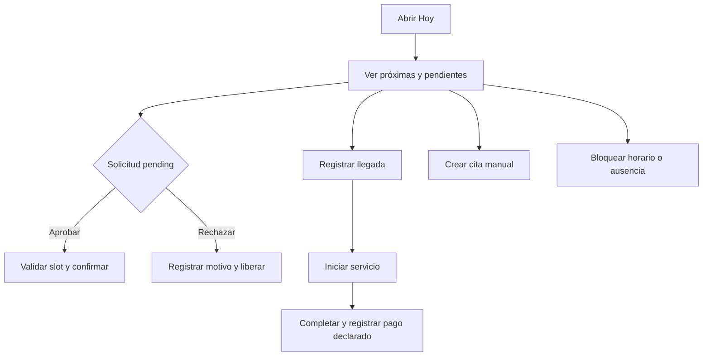
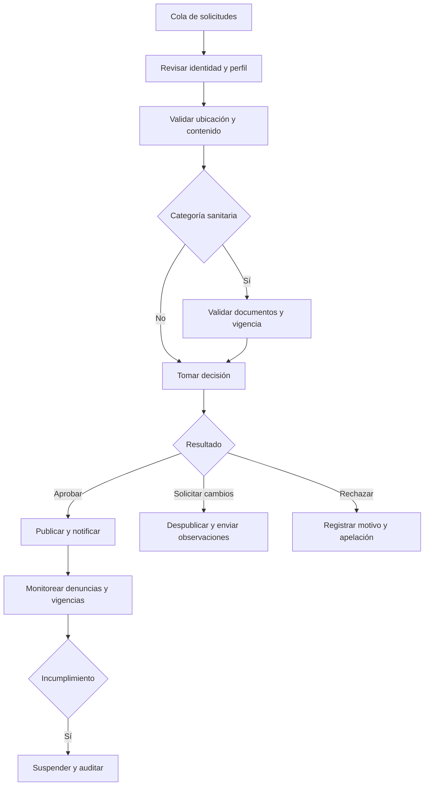

# ToAgenda Ecuador — Flujos de aplicaciones

**Versión:** 1.0  
**FigJam:** [ToAgenda Ecuador — Flujo maestro MVP](https://www.figma.com/board/JLt7Snimw2ebPS3XjCyz60)  
**Prototipo Figma:** Pendiente de creación después de aprobar la fase de descubrimiento visual. Este documento es la fuente funcional; el prototipo no puede contradecirlo.

## 1. Estados oficiales

Una reprogramación conserva el estado aplicable, registra el horario anterior y valida el nuevo espacio. Si una reserva manual cambia de fecha, vuelve a `pending`; una automática permanece `confirmed` después de una transacción exitosa.

## 2. Navegación — ToAgenda

Barra inferior:

1. **Inicio:** buscador, categorías, cerca de ti, disponible hoy y reservar nuevamente.
2. **Explorar:** filtros y alternancia lista/mapa.
3. **Citas:** pendientes, próximas e historial.
4. **Favoritos:** negocios guardados.
5. **Perfil:** cuenta, ubicación, notificaciones, privacidad y ayuda.

## 3. Alta y ubicación del consumidor

- No se solicita permiso antes de explicar para qué se utilizará.
- Negar ubicación nunca bloquea búsqueda ni reserva.
- Marketing es opcional y separado de comunicaciones operativas.

## 4. Descubrimiento y ficha

Estados contemplados: sin resultados, ubicación aproximada, negocio sin disponibilidad, red lenta, error recuperable, perfil suspendido y contenido aún no cargado.

## 5. Reserva

Fallos:

- Si vence el hold, se informa y se vuelve a disponibilidad.
- Si otro actor tomó el slot, se ofrecen alternativas próximas.
- Si falla la carga de comprobante, no se crea una reserva que lo requiera.
- Repetir una solicitud con la misma clave de idempotencia devuelve el mismo resultado.

## 6. Gestión de una cita

- `pending`: cancelar; esperar aprobación; ver tiempo límite.
- `confirmed`: cancelar o reprogramar según política, navegar y añadir a calendario.
- `rejected`/`expired`: ver motivo permitido y buscar otro horario.
- `completed`: volver a reservar y dejar una reseña.
- `cancelled_*`/`no_show`: consultar historial sin acciones operativas.

Reprogramar ejecuta: elegir nueva disponibilidad → crear hold → confirmar política → validar → liberar horario anterior solo cuando el nuevo quede reservado.

## 7. Navegación — ToAgenda Pro

Barra inferior:

1. **Hoy:** resumen y acciones urgentes.
2. **Agenda:** día, semana, mes y filtros.
3. **Clientes:** búsqueda, historial y notas operacionales.
4. **Equipo:** miembros, servicios y disponibilidad.
5. **Más:** negocio, locales, catálogo, pagos, reportes y soporte.

## 8. Incorporación del negocio

El negocio puede operar en modo borrador, pero no recibir reservas del marketplace antes de aprobación.

## 9. Operación diaria Pro

- Si el slot dejó de ser válido al aprobar, el sistema no confirma y solicita proponer otro horario.
- Las acciones sensibles muestran confirmación y quedan auditadas.

## 10. Moderación administrativa

## 11. Estructura del archivo Figma

1. `00 Cover & changelog`
2. `01 Foundations`
3. `02 Components`
4. `03 FigJam flows`
5. `04 Consumer wireframes`
6. `05 Consumer hi-fi`
7. `06 Pro wireframes`
8. `07 Pro hi-fi`
9. `08 Admin desktop`
10. `09 Prototype`
11. `10 States & accessibility`

El prototipo debe cubrir como mínimo: descubrimiento y reserva automática, reserva manual, onboarding Pro, aprobación administrativa y gestión diaria de una cita.
