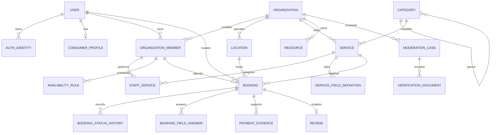

# ToAgenda Ecuador — Esquema de backend

**Versión:** 1.0  
**Motor:** PostgreSQL 16 + PostGIS  
**Convención:** nombres físicos `snake_case`, IDs UUID, fechas `timestamptz`

## 1. Principios

- `organization_id` es la frontera de aislamiento para información de negocios.
- PostgreSQL es la fuente de verdad de disponibilidad y reservas.
- Dinero se almacena en centavos enteros y moneda ISO 4217 (`USD`).
- Fechas se almacenan en UTC; cada ubicación mantiene una zona IANA, inicialmente `America/Guayaquil`.
- Registros comerciales usan eliminación lógica cuando requieren trazabilidad.
- Reservas, transiciones y auditoría son inmutables salvo correcciones administrativas auditadas.
- Datos flexibles utilizan JSONB únicamente con esquema y versión conocidos.

## 2. Diagrama de dominios

## 3. Identidad y acceso

### `users`

`id`, `status`, `display_name`, `primary_phone`, `primary_email`, `locale`, `created_at`, `updated_at`, `deleted_at`.

### `auth_identities`

`id`, `user_id`, `provider` (`phone`, `email`), `provider_subject`, `verified_at`, `created_at`. Restricción única por proveedor/sujeto.

### `auth_sessions`

`id`, `user_id`, `refresh_token_hash`, `token_family_id`, `device_name`, `ip_hash`, `expires_at`, `revoked_at`, `created_at`.

### `consumer_profiles`

`user_id`, `default_location_source`, `default_point`, `province`, `canton`, `sector`, `marketing_consent_at`, `updated_at`.

La precisión de ubicación se conserva solo cuando es necesaria y conforme a consentimiento.

## 4. Organizaciones y permisos

### `organizations`

`id`, `legal_name`, `display_name`, `slug_internal`, `description`, `business_mode`, `phone`, `whatsapp`, `email`, `logo_key`, `banner_key`, `status`, `moderation_status`, `health_related`, `created_at`, `updated_at`, `deleted_at`.

`slug_internal` sirve para enlaces profundos, no crea una página web pública.

### `organization_members`

`id`, `organization_id`, `user_id`, `role`, `public_name`, `bio`, `photo_key`, `bookable`, `active`, `commission_basis_points`, `created_at`, `deleted_at`.

Roles iniciales: `owner`, `manager`, `receptionist`, `professional`.

### `member_permissions`

Permisos excepcionales sobre el rol: `member_id`, `permission`, `effect`, `created_at`. Los permisos explícitamente denegados prevalecen.

### `locations`

`id`, `organization_id`, `name`, `type` (`physical`, `home_private`, `service_area`, `virtual`), dirección normalizada, `point geography(Point,4326)`, provincia, cantón, sector, `timezone`, `hide_exact_address`, contacto, instrucciones privadas, estado y timestamps.

Índice GiST sobre `point`; dirección exacta de `home_private` no se expone en descubrimiento.

## 5. Categorías y catálogo

### `categories`

`id`, `parent_id`, `name`, `normalized_name`, `icon_key`, `health_related`, `active`, `sort_order`, timestamps. Solo administración modifica esta tabla.

### `services`

`id`, `organization_id`, `category_id`, `name`, `description`, `price_type` (`fixed`, `from`), `price_cents`, `currency`, `duration_minutes`, `buffer_before_minutes`, `buffer_after_minutes`, `confirmation_mode` (`automatic`, `manual`), `booking_lead_minutes`, `booking_horizon_days`, `cancellation_cutoff_minutes`, `active`, timestamps y `deleted_at`.

### `service_locations`, `staff_services`

Tablas de relación que determinan dónde y quién puede prestar el servicio. `staff_services` puede sobrescribir duración y precio si el producto lo habilita en una fase posterior; en MVP usa valores del servicio.

### `service_modalities`

`service_id`, `modality` (`at_location`, `at_customer`, `virtual`), radio, costo de desplazamiento y configuración aplicable.

### `service_field_definitions`

`id`, `service_id`, `key`, `label`, `type`, `required`, `schema_version`, `json_schema`, `sort_order`, `active`.

Los esquemas rechazan claves clínicas reservadas y tipos no soportados.

### `resources`, `service_resources`

Recursos físicos como cabina, silla o equipo. Se define cantidad o instancia concreta. Un servicio puede requerir uno o varios tipos de recurso.

## 6. Horarios

### `location_hours`

Reglas semanales por ubicación: día ISO, hora inicial/final local y vigencia.

### `availability_rules`

Reglas semanales por miembro y ubicación, con zona horaria y periodo de vigencia.

### `schedule_exceptions`

Excepciones `available` o `unavailable` para ubicación, miembro o recurso, con rango UTC, motivo y creador.

### `schedule_blocks`

Bloqueos operativos con rango UTC, alcance, motivo, creador y eliminación lógica.

La generación de slots se realiza bajo demanda por ventana y se cachea brevemente. No se materializan todos los slots futuros.

## 7. Reservas y retenciones

### `booking_holds`

`id`, consumidor, organización, servicio, ubicación, profesional, rango UTC, recursos seleccionados, `availability_version`, `expires_at`, `consumed_at`, `released_at`, `idempotency_key`.

### `bookings`

`id`, `organization_id`, `consumer_user_id`, `service_id`, `location_id`, `staff_member_id`, `status`, `source`, `start_at`, `end_at`, buffers materializados, nombre/precio/duración capturados como snapshot, moneda, modalidad, política capturada, pago seleccionado, zona horaria, `version`, timestamps y `deleted_at`.

El snapshot impide que cambios posteriores del catálogo alteren una cita existente.

### `booking_resources`

`booking_id`, `resource_id`, rango ocupado.

### `booking_status_history`

`id`, `booking_id`, `from_status`, `to_status`, `actor_type`, `actor_id`, `reason_code`, nota segura, `created_at`.

### `booking_field_answers`

`booking_id`, `field_definition_id`, `schema_version`, `value_json`, timestamps. Se validan contra el esquema capturado.

### Prevención de conflictos

- Activar `btree_gist`.
- Crear rangos `tstzrange` para tiempo ocupado, incluyendo buffers.
- Aplicar exclusión GiST por profesional para estados `pending` y `confirmed`.
- Aplicar exclusión GiST por recurso mediante `booking_resources` para los mismos estados.
- Las transiciones que liberan espacio actualizan el indicador de ocupación dentro de la misma transacción.
- Reprogramar bloquea la reserva, valida el nuevo rango, registra historia y solo entonces libera el anterior.

## 8. Pagos declarados

### `organization_payment_methods`

`id`, `organization_id`, `type` (`cash`, `bank_transfer`, `card_on_site`, `external_link`), etiqueta, instrucciones, URL externa cifrada cuando aplique, `requires_evidence`, `active`.

### `payment_evidence`

`id`, `booking_id`, `method_id`, `file_key`, `declared_amount_cents`, `status` (`submitted`, `accepted`, `rejected`), revisor, timestamps.

ToAgenda no interpreta un comprobante como liquidación financiera ni almacena tarjetas.

## 9. Descubrimiento y confianza

### `favorites`

Clave única `user_id`, `organization_id`; timestamps.

### `reviews`

`id`, `booking_id` único, `organization_id`, consumidor, puntuación 1–5, comentario, estado de moderación, timestamps. Solo una reserva `completed` habilita su creación.

### `moderation_cases`

`id`, `organization_id`, tipo, estado, asignado, resumen, decisión, motivo, timestamps.

### `verification_documents`

`id`, `moderation_case_id`, `organization_id`, tipo, `file_key`, número cifrado, emisor, emisión, vencimiento, estado y revisor.

### `reports`

Denuncias sobre negocio, servicio, imagen o reseña, con categoría, detalle, estado y resolución.

## 10. Notificaciones, planes y auditoría

### `notification_preferences`, `notification_deliveries`

Preferencias por canal y propósito. Cada entrega guarda clave idempotente, plantilla/versión, destino protegido, intentos, proveedor, estado y error seguro.

### `subscription_plans`, `plan_entitlements`, `organization_subscriptions`

Modelo de planes y límites listo para activación futura. Durante piloto todas las organizaciones seleccionadas reciben el plan de piloto sin cobro.

### `audit_logs`

Actor, acción, recurso, organización, trace ID, IP protegida, cambios redactados y fecha. No admite modificación desde la aplicación.

## 11. Índices y aislamiento

- Índices compuestos por `organization_id` y estado/fecha para agenda, clientes y catálogo.
- GiST para puntos y rangos de tiempo.
- Índices parciales para registros activos y negocios aprobados.
- Búsqueda textual con columnas normalizadas y `pg_trgm`; motor externo solo si las métricas lo justifican.
- Todos los repositorios Pro exigen contexto de organización.
- Pruebas automáticas intentan acceso cruzado para cada agregado sensible.

## 12. Retención y eliminación

- Eliminación de cuenta inicia un proceso verificable y revoca sesiones.
- Datos sin obligación de conservación se eliminan o anonimizan según política.
- Reservas, decisiones y auditoría conservan los campos mínimos necesarios.
- Archivos privados vencen mediante reglas del bucket después de quedar elegibles.
- La matriz final de retención requiere revisión legal ecuatoriana antes de producción.

